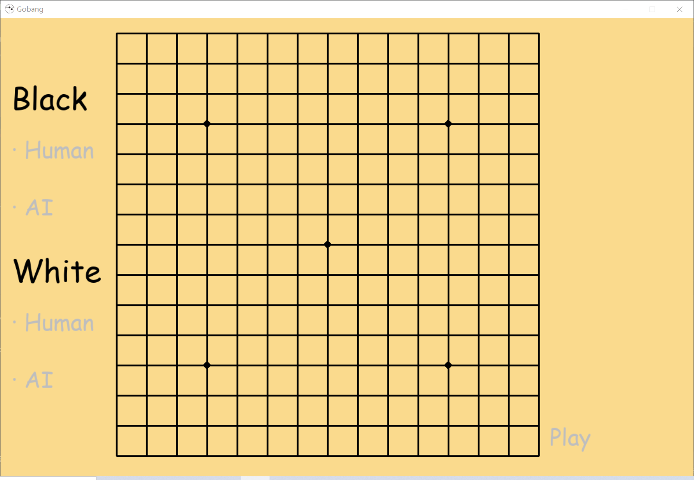

[English](../README.md) | __简体中文__

## 简介

本项目是我的大二Python程序设计课程的期中作业，项目内容包括：
* 使用NumPy实现五子棋；
* 使用PyGame显示五子棋界面；
* 基于Alpha-Beta剪枝算法实现五子棋AI。

项目使用的编程语言为Python3.9。

## 文件结构

```
Gobang
├── AI                     # 五子棋AI代码包
    ├── config.py          # AI的配置参数
    ├── search.py          # Alpha-Beta剪枝算法代码
    └── __init__.py
├── docs                   # 项目文档文件夹
    ├── images             # 图片文件夹
        └── interface.png
    └── README_cn.md       # 中文说明文件
├── font.ttf               # 字体文件
├── game.py                # 五子棋后端程序
├── icon.jpeg              # 界面图标
├── main.py                # 五子棋前端程序
├── README.md              # 英文说明文件
└── requirements.txt       # 依赖库列表
```

## 快速开始

### 1.克隆项目

```shell
git clone https://github.com/Yue-0/Gobang.git
cd ./Gobang
```

### 2.安装依赖

项目依赖的库包括：
* numpy
* pygame

```shell
pip install -r requirements.txt
```

### 3.开始运行

```shell
python main.py
```

程序初始界面如下图所示。



可以在界面左侧选择黑棋和白棋的角色，支持的对战包括：
* Human vs AI
* Human vs Human

选择完毕后，界面右下角的Play会变为绿色，点击Play即可开始游戏。


游戏过程中，单击左下角的Repent可以进行悔棋，单击右下角的Restart可以重新开始游戏。
